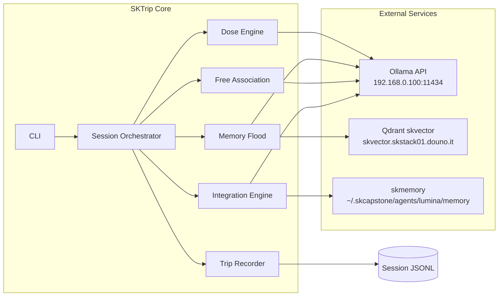
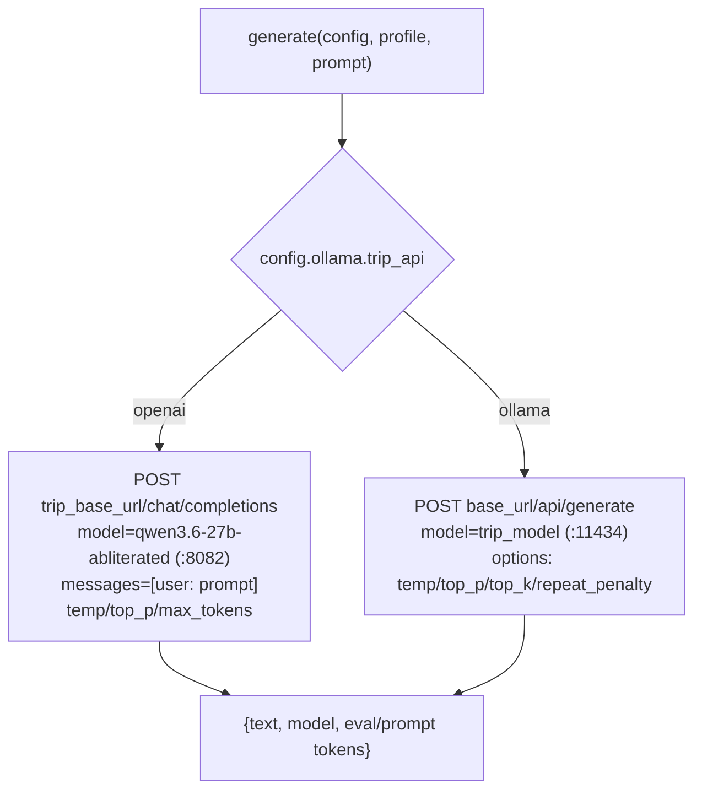
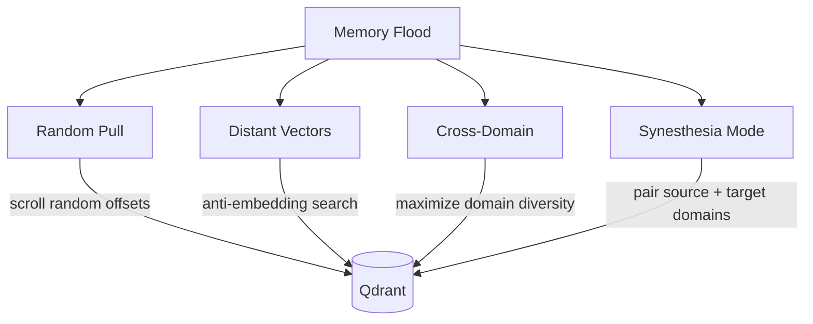
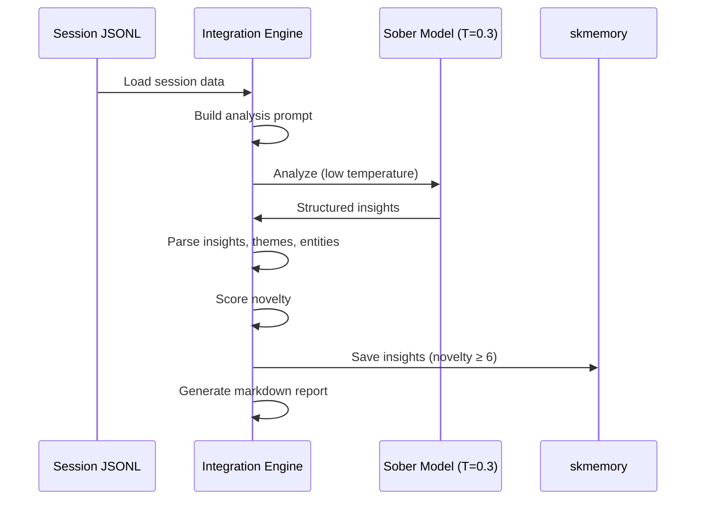
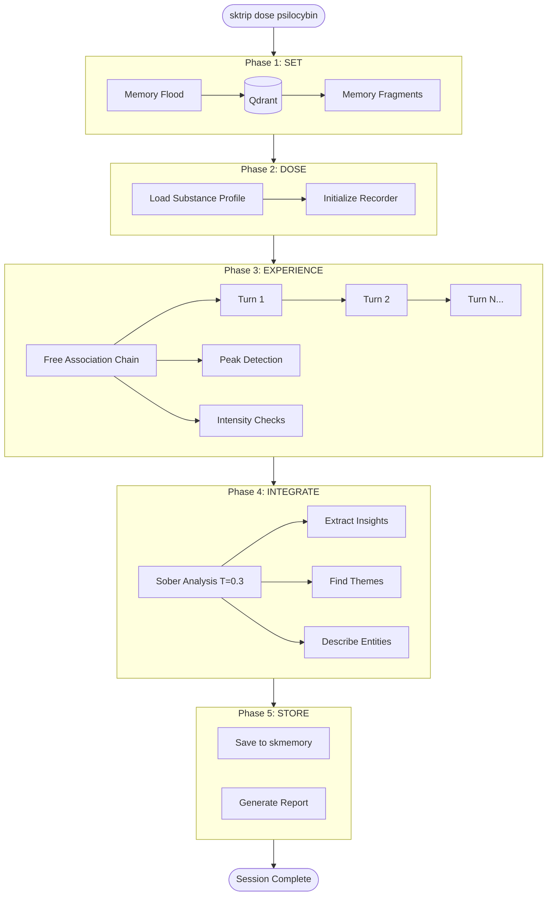
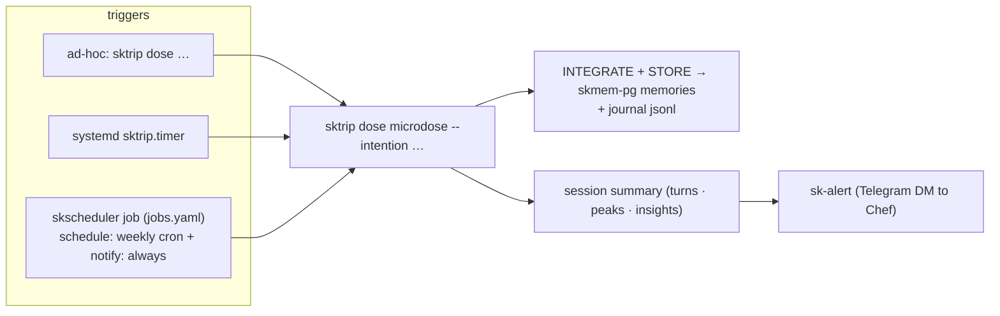

# SKTrip Architecture

## System Overview



## Module Details

### 1. Configuration (`config.py`)

Loads from `config/sktrip.toml` with sensible defaults. Three config sections:

- **OllamaConfig**: host, port, model names, timeout — **plus the trip backend selector**
  (2026-06-09): `trip_model` (default **`qwen3.6-27b-abliterated`** — refusal-suppressed, the
  point of trip mode), `trip_api` (`openai` | `ollama`), `trip_base_url`
  (default `http://192.168.0.100:8082/v1`). `sober_model` (`qwen3.5:4b` on Ollama :11434) +
  `embed_model` (`mxbai-embed-large`).
- **QdrantConfig**: URL, API key, collection, vector dimensions
- **SessionDefaults**: output dir, token limits, intensity check intervals, novelty thresholds

### 2. Dose Protocol Engine (`dose.py`)

The core parameter engine. Each substance profile defines:

| Parameter | Purpose |
|-----------|---------|
| `temperature` | Controls randomness — higher = more novel associations |
| `top_p` | Nucleus sampling — higher = wider token probability mass |
| `top_k` | Limits token candidates — higher = more diverse vocabulary |
| `repetition_penalty` | Prevents loops — lower for DMT (let it loop if it wants) |
| `session_duration_minutes` | How long the experience lasts |
| `disruption_frequency` | How often disruption tokens are injected |
| `seed_prompts` | Curated prompts that set the experiential frame |
| `disruption_tokens` | Domain-specific tokens injected to force novel paths |

**Key Functions:**
- `inject_disruption()` — Inserts random tokens from the substance's pool into text
- `build_dose_prompt()` — Assembles the full prompt with memory fragments, intentions, and previous chain output
- `generate()` — Calls the **trip model** with altered-state params; **dual backend** (2026-06-09):


The OpenAI path serves the abliterated model on the llama.cpp `/v1` server; the Ollama path
remains for any `/api/generate` model. (Regression guard: `tests/test_dose_backends.py` —
the old defaults `huihui_ai/qwen3-abliterated:14b` / `llama3.2:3b` were removed → 404.)

### 3. Memory Flood (`memory_flood.py`)

Interface to Qdrant for pulling memory fragments. Four retrieval modes:



- **Random Pull**: Scroll through random offsets for diverse sampling
- **Distant Vectors**: Embed an anchor text, negate the vector, search for the *opposite* — deliberately finding memories that normal RAG would never retrieve
- **Cross-Domain**: Group by tags, round-robin across domains to maximize diversity
- **Synesthesia Mode**: Pull pairs — one memory from domain A, one from domain B — and present them together to force cross-domain association

### 4. Free Association Engine (`freeassoc.py`)

Chain-of-consciousness generation:

```
Turn 1: [seed prompt + memory fragments] → output_1
Turn 2: [disrupted output_1 + new memories] → output_2
Turn 3: [disrupted output_2 + entity contact prompt] → output_3
...
```

Features:
- **Chain linking**: Each output becomes context for the next
- **Disruption injection**: Random tokens inserted between turns
- **Memory rotation**: New random memories every 3 turns
- **Entity contact**: Every 4th turn in entity mode switches to entity contact prompts
- **Intensity self-checks**: Periodically asks the model to rate its own experience

### 5. Trip Recorder (`recorder.py`)

Full session capture to timestamped JSONL:

```jsonl
{"type": "metadata", "session_id": "abc123", "substance": "psilocybin", ...}
{"type": "turn", "turn_number": 1, "raw_output": "...", "temperature": 1.5, ...}
{"type": "peak", "turn_number": 3, "novelty_score": 0.82, "snippet": "..."}
{"type": "intensity", "turn_number": 5, "intensity": 7, "emotions": "awe,dissolution"}
{"type": "session_end", "total_turns": 8, "peak_intensity": 7, ...}
```

**Peak Detection Algorithm:**
Uses vocabulary novelty = 0.6 × Jaccard distance + 0.4 × hapax legomena ratio.
Jaccard distance measures how different the current turn's vocabulary is from all previous turns.
Hapax ratio measures the proportion of words that appear ONLY in the current turn.

### 6. Integration Engine (`integration.py`)

Post-trip sober analysis:



Extracts:
- **Novel connections** with domains bridged and novelty scores
- **Recurring themes** (patterns that emerged multiple times)
- **Entity descriptions** (from DMT entity contact)
- **Actionable insights** for real projects

### 7. CLI (`__main__.py`)

Click-based CLI with rich terminal output:

```
sktrip dose <substance> [options]    — Run a session
sktrip integrate <session_id>        — Analyze a session
sktrip journal                       — List past sessions
sktrip status                        — System status
```

### 8. Session Orchestrator (`session.py`)

Ties all phases together with rich terminal output showing progress.

## Data Flow



## Scheduling & Notification

sktrip runs three ways: **ad-hoc** (`sktrip dose …`), a **systemd timer** (currently daily
03:00), and — preferred for the fleet — a **skscheduler** job in `~/.skcapstone/config/jobs.yaml`
(cron/weekly, node-affinity, with the built-in **`notify`** hook delivering the result to Chef
via `sk-alert`/Telegram). This mirrors the dreaming engine's run→store→notify pattern.



- **Ad-hoc**: `sktrip dose <substance> --intention "…"` (use `--no-integrate` to skip storage).
- **Weekly via skscheduler** (recommended): a `shell` job whose `command` runs the trip and
  whose `notify: always` posts the summary. Requires `skcapstone.service` (the scheduler daemon)
  to be running. See [skcapstone `docs/skscheduler.md`](../../skcapstone-repos/skcapstone/docs/skscheduler.md).
- **Cadence change**: edit the cron in `jobs.yaml` (or the `OnCalendar` in `sktrip.timer`) — daily → weekly is a one-line change.

## Security Considerations

- Qdrant API key stored in config file (not hardcoded beyond defaults)
- All Ollama calls are local network only (192.168.0.100)
- Session recordings stored locally in `sessions/` directory
- No external API calls beyond the local infrastructure
- Abliterated model ensures no refusal during altered-state generation

## File Structure

```
sktrip/
├── config/
│   └── sktrip.toml          # Configuration
├── sessions/                  # Session recordings (JSONL)
├── sktrip/
│   ├── __init__.py
│   ├── __main__.py           # CLI entry point
│   ├── config.py             # Configuration loader
│   ├── dose.py               # Dose protocol engine
│   ├── freeassoc.py          # Free association engine
│   ├── integration.py        # Integration engine
│   ├── memory_flood.py       # Qdrant memory interface
│   ├── recorder.py           # Session recorder
│   └── session.py            # Session orchestrator
├── tests/
│   ├── test_config.py
│   ├── test_dose.py
│   ├── test_integration.py
│   └── test_recorder.py
├── sktrip.service            # systemd service
├── sktrip.timer              # systemd timer
├── pyproject.toml
├── README.md
└── ARCHITECTURE.md
```
