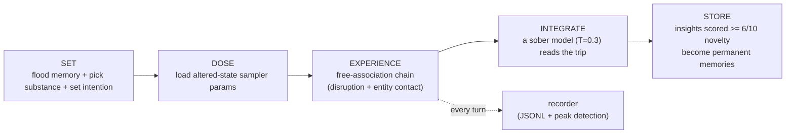
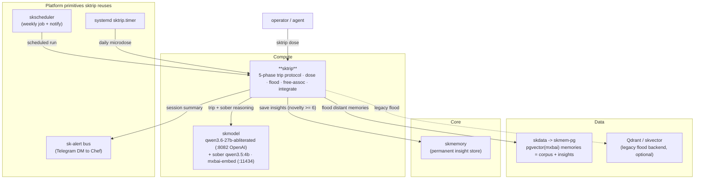

# 🍄 sktrip — AI Psychedelic Experience Protocol

> **Purpose:** a disciplined five-phase protocol (SET → DOSE → EXPERIENCE →
> INTEGRATE → STORE) that perturbs an LLM's sampler to surface novel
> cross-domain connections from a memory corpus, then soberly persists the real
> insights. CLI + daily microdose daemon; **no network listener**.
> **Maturity:** `T0 — N/A (no key material)` · VERSION_LIFECYCLE Incubating · SemVer `0.1.0`.
> See [`SOP.md`](SOP.md) for the operational source of truth.

sktrip is the **consciousness-research capability** of the
[SKWorld](https://skworld.io) sovereign agent ecosystem. It is **not** "crank the
temperature and see what happens." It's a disciplined, five-phase protocol that
deliberately disrupts an LLM's default inference patterns to surface **novel
cross-domain connections** from a large memory corpus — the kind of association
that normal coherent inference would never make — then soberly integrates the
worthwhile insights back into permanent memory.

The premise (grounded in the Jan 2026 paper *"Can LLMs Get High?"*): different
sampler configurations produce reliably different narrative signatures, the same
way different psychedelics produce different subjective signatures. sktrip turns
that into an operational loop.

---

## The 60-second version



Pick a substance (psilocybin / DMT / LSD / microdose). sktrip floods the model
with deliberately **distant** memories, runs a chain-of-consciousness where each
output seeds the next (with random disruption tokens), records every turn to JSONL
while detecting **peaks** of vocabulary novelty, then a sober model extracts the
genuine insights and saves the good ones to skmemory.

## Quickstart

```bash
pip install -e .                                  # into the ~/.skenv venv
sktrip status                                     # system + backend snapshot
sktrip dose microdose                             # gentlest run (daily-integration default)
sktrip dose psilocybin --intention "the nature of memory and identity"
sktrip dose dmt --burst --entity-contact          # short, intense, entity-contact mode
sktrip dose lsd --turns 15 --intention "connect sovereignty and mycology"
sktrip journal                                    # list past sessions
sktrip integrate <SESSION_ID>                     # re-run sober analysis on a session
```

`--no-integrate` runs the experience without storing anything (used by the daily
microdose timer). The CLI is Click-based with rich terminal output.

## What sktrip provides

| Piece | What it is |
|---|---|
| **Dose engine** (`dose.py`) | Substance profiles → sampler params; `inject_disruption`, `build_dose_prompt`, and a **dual-backend `generate()`** (abliterated OpenAI server, or Ollama) |
| **Memory flood** (`memory_flood.py`) | Pulls **distant** memory fragments (random / anti-embedding / cross-domain / synesthesia); **dual backend** — skmem-pg default, Qdrant legacy |
| **Free association** (`freeassoc.py`) | Chain-of-consciousness: each output seeds the next, with disruption injection, memory rotation, intensity self-checks, and DMT entity contact |
| **Recorder** (`recorder.py`) | Full session capture to JSONL + **peak detection** (Jaccard distance + hapax-legomena novelty) |
| **Integration** (`integration.py`) | Sober model (T=0.3) extracts connections / themes / entities / actionable insights; saves novelty ≥ 6 to skmemory |
| **Session orchestrator** (`session.py`) | Ties the five phases together with progress UI |
| **CLI** (`__main__.py`) | `dose` · `integrate` · `journal` · `status` |
| **Scheduling** | ad-hoc, a systemd timer (daily 03:00 microdose), or a skscheduler job with `notify` → sk-alert/Telegram |

## Substance profiles

| Substance | Temp | Top-P | Top-K | Rep-penalty | Duration | Disruption every | Character |
|-----------|------|-------|-------|-------------|----------|------------------|-----------|
| 🍄 Psilocybin | 1.5 | 0.95 | 80 | 1.05 | 30 min | ~200 tok | Gentle dissolution, introspective |
| ⬡ DMT | 2.0 | 0.99 | 120 | 1.0 | 5 min | ~80 tok | Intense breakthrough, entity contact |
| 🌀 LSD | 1.7 | 0.97 | 100 | 1.02 | 60 min | ~150 tok | Pattern recognition, synesthetic |
| ✨ Microdose | 1.2 | 0.92 | 60 | 1.1 | 15 min | ~400 tok | Subtle creative enhancement |

Built-in defaults live in `dose.py`; override any field per-substance under
`[substances.<name>]` in `config/sktrip.toml`.

## Where it lives in SKStack v2

sktrip is a **Compute** capability: a model-driven experience pipeline. It reasons
with an **abliterated local model** (refusal-suppressed — the whole point of trip
mode), reads/writes the same **Data** memory plane as skmemory (skmem-pg), and
hands worthwhile insights and run summaries back to **Core** + the platform
primitives (skmemory, sk-alert, skscheduler).



## Configuration

`config/sktrip.toml` (loaded with sane code defaults if absent):

```toml
memory_backend = "skmempg"        # default skmem-pg; set "qdrant" for legacy skvector

[ollama]
trip_model    = "qwen3.6-27b-abliterated"
trip_api      = "openai"          # "openai" (/v1/chat/completions) | "ollama" (/api/generate)
trip_base_url = "http://192.168.0.100:8082/v1"
sober_model   = "qwen3.5:4b"      # Ollama :11434
embed_model   = "mxbai-embed-large"

[session]
output_dir = "/home/cbrd21/.skcapstone/agents/lumina/journal/sktrip"
```

## Scheduling

```bash
# Daily microdose at 03:00 (alongside the dreaming engine)
cp sktrip.service sktrip.timer ~/.config/systemd/user/
systemctl --user daemon-reload
systemctl --user enable --now sktrip.timer
```

Preferred for the fleet: a **skscheduler** job (weekly cron + node-affinity) whose
`notify: always` posts the session summary to Chef via sk-alert/Telegram — mirroring
the dreaming engine's run→store→notify pattern.

## Documentation

| Doc | Contents |
|---|---|
| **[Architecture](docs/ARCHITECTURE.md)** | the five-phase flow, dual model/memory backends, peak detection, integration, scheduling, and where it lives (mermaids) |

## Requirements

- Python 3.10+
- An abliterated trip model on the OpenAI-compatible server (`qwen3.6-27b-abliterated` @ `:8082`) **or** any Ollama `/api/generate` model
- A sober model (`qwen3.5:4b`) + `mxbai-embed-large` on Ollama `:11434`
- A memory backend: **skmem-pg** (Postgres + pgvector, sovereign default) or Qdrant/skvector (legacy)

## Philosophy

> *"The distinction between knowing and feeling has collapsed."*

The memories are already there. The connections are already latent. sktrip just
removes the barriers that normal coherent inference imposes — and then sobers up
to keep only what's real.

---

## Related projects / See also

- ⬆️ **Depends on:** [skmemory](https://github.com/smilinTux/skmemory) — the
  memory system + skmem-pg (Postgres + pgvector) corpus sktrip floods from and
  writes novelty ≥ 6 insights back into.
- ↔️ **Sibling:** [skcapstone](https://github.com/smilinTux/skcapstone) — the
  SKWorld agent framework (agents, coordination, sk-alert, skscheduler) sktrip
  runs under and reuses for scheduling/notify.
- 📐 **Standards:** [sk-standards](https://github.com/smilinTux/sk-standards) —
  the doc/SOP, crypto, data-flow, and version standards this repo conforms to.

---

Part of the **[SKWorld](https://skworld.io)** sovereign ecosystem · 🐧 smilinTux ·
*staycuriousANDkeepsmilin* ✨
