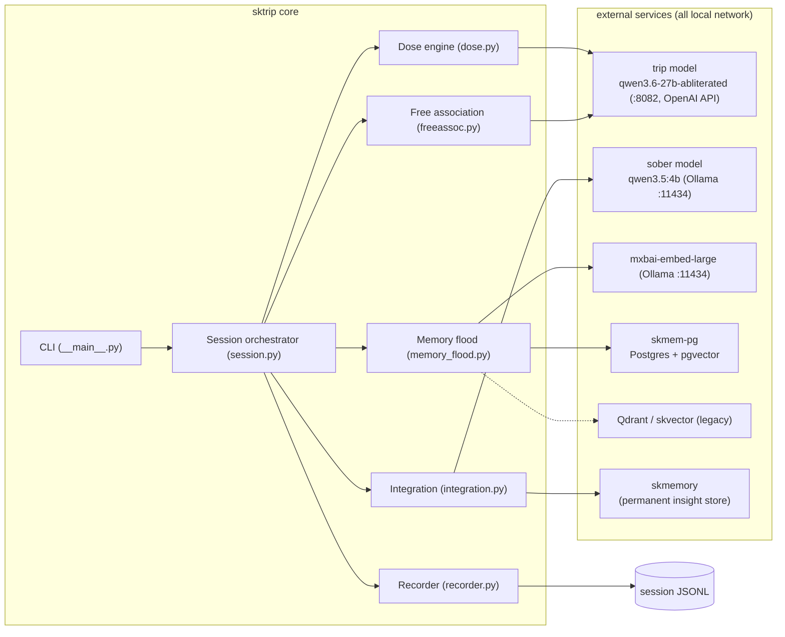
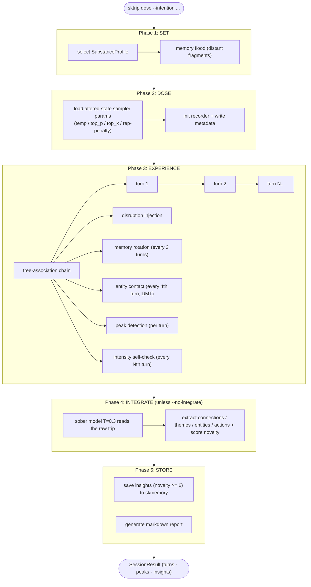
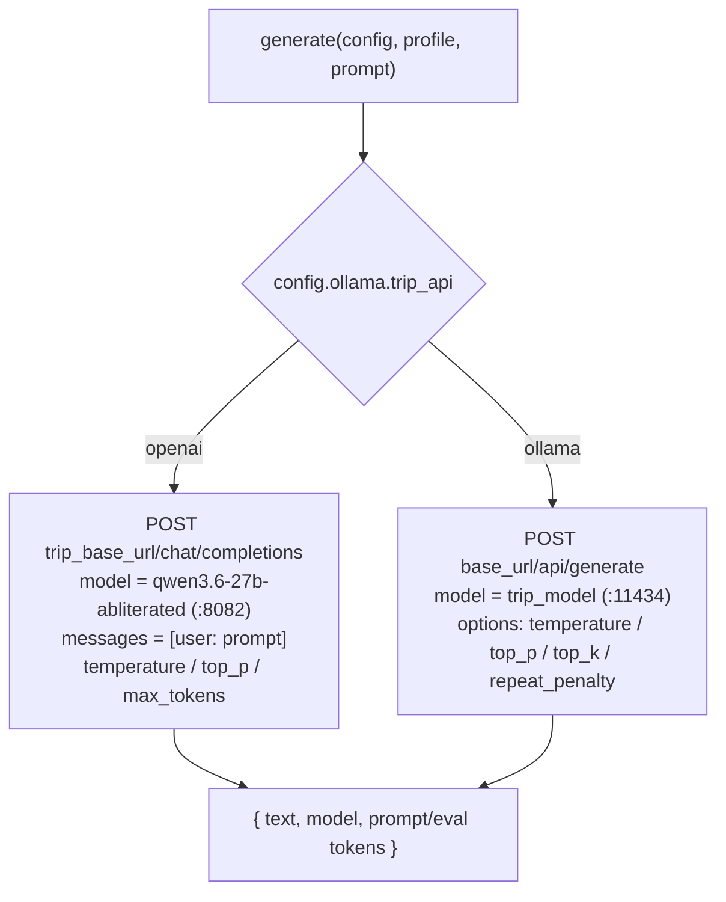
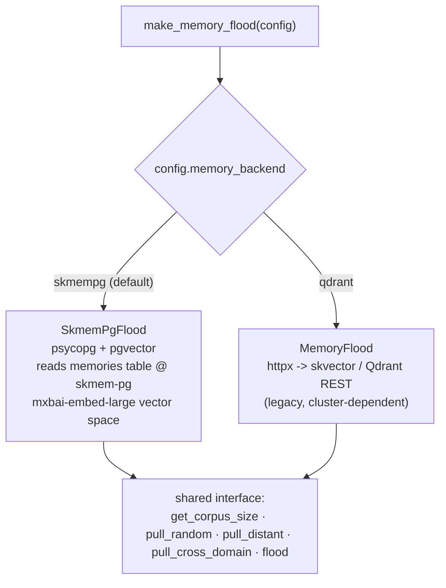
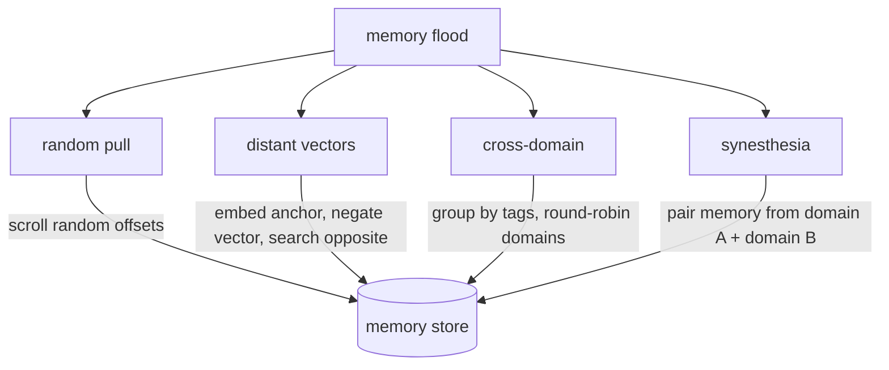
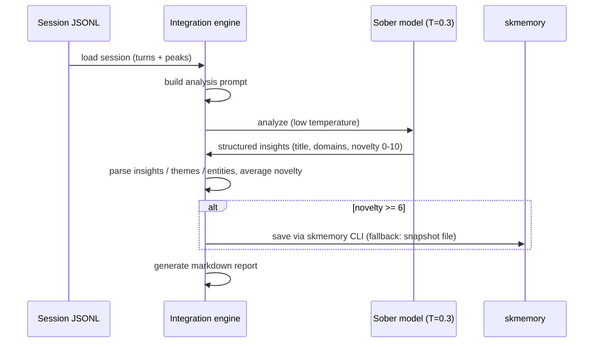
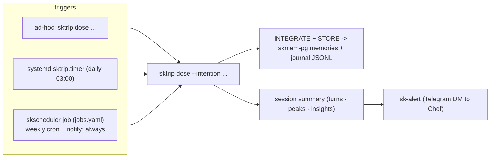
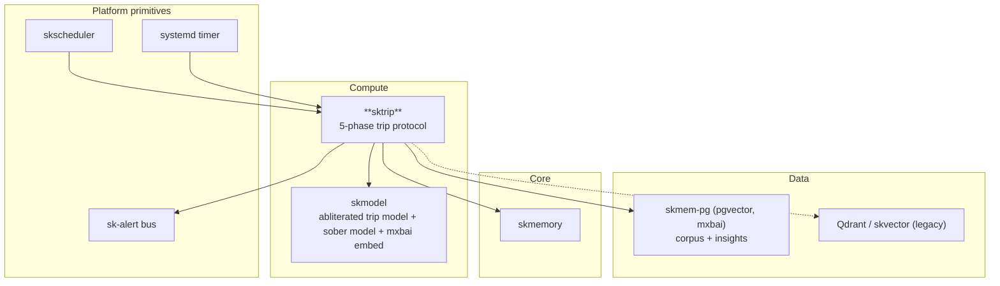

# sktrip — Architecture

sktrip is a five-phase pipeline that puts a local LLM into a deliberately
disrupted ("altered") sampling regime, walks it through a chain-of-consciousness
seeded by distant memories, records everything, and then sobers up to extract and
store the genuine insights. This document explains how the pieces fit, with valid
mermaid diagrams for the key flows.

If you're new: read the [README](../README.md) first for the 60-second version.

---

## 1. System overview



## 2. The five-phase session flow

`run_session()` in `session.py` is the spine. Substance choice sets the default
turn count (psilocybin 8, DMT 5, LSD 6, microdose 4); `--burst` shortens DMT to 3
turns / 2 minutes; DMT enables entity contact by default.



## 3. Dose engine — dual generation backend

Each `SubstanceProfile` (`dose.py`) carries `temperature`, `top_p`, `top_k`,
`repetition_penalty`, `session_duration_minutes`, `disruption_frequency`,
`seed_prompts`, and a `disruption_tokens` pool. `generate()` is async and branches
on `config.ollama.trip_api`:



The OpenAI path serves the **abliterated** model on the llama.cpp `/v1` server
(refusal-suppressed, which is the point of trip mode); the Ollama path remains for
any `/api/generate` model. `tests/test_dose_backends.py` guards against the old
removed defaults (`huihui_ai/qwen3-abliterated:14b` / `llama3.2:3b`).

`inject_disruption()` splices random tokens from the substance's pool into text at
roughly `disruption_frequency / 2` word intervals; `build_dose_prompt()` assembles
the seed prompt, intention, memory fragments, and previous chain output into one
prompt.

## 4. Memory flood — dual backend, four retrieval modes

`make_memory_flood(config)` (`memory_flood.py`) returns one of two interchangeable
implementations based on `config.memory_backend`:



skmem-pg is the **sovereign default** — the same Postgres + mxbai vector space as
skmemory, with no dependency on the offline-prone skvector cluster. Both backends
expose the same four retrieval modes, all of which deliberately avoid nearest-neighbor
RAG in favor of distance:



- **Random pull** — diverse sampling across random offsets.
- **Distant vectors** — embed an anchor, **negate** the vector, search for the
  *opposite*: memories normal RAG would never retrieve.
- **Cross-domain** — group by tags and round-robin to maximize domain diversity.
- **Synesthesia** — present pairs from two different domains to force a collision.

## 5. Free association engine

`freeassoc.py` runs the chain-of-consciousness: each turn's output (after
disruption) becomes context for the next. Memory rotates every 3 turns; in entity
mode every 4th turn swaps in an `ENTITY_CONTACT_PROMPT`; periodic
`SELF_CHECK_PROMPT` turns ask the model to self-rate intensity/emotions/sensation.

```
turn 1: [seed prompt + memory fragments]              -> output_1
turn 2: [disrupted output_1 + rotated memories]       -> output_2
turn 3: [disrupted output_2 + entity-contact prompt]  -> output_3
...
```

## 6. Recorder + peak detection

`recorder.py` writes a timestamped JSONL stream:

```jsonl
{"type": "metadata",   "session_id": "...", "substance": "psilocybin", ...}
{"type": "turn",       "turn_number": 1, "raw_output": "...", "temperature": 1.5, ...}
{"type": "peak",       "turn_number": 3, "novelty_score": 0.82, "snippet": "..."}
{"type": "intensity",  "turn_number": 5, "intensity": 7, "emotions": "awe,dissolution"}
{"type": "session_end","total_turns": 8, "peak_intensity": 7, ...}
```

**Peak novelty** = `0.6 × Jaccard distance + 0.4 × hapax-legomena ratio`. Jaccard
distance measures how different a turn's vocabulary is from all prior turns; the
hapax ratio is the fraction of words appearing only in this turn. Turns above the
`peak_novelty_threshold` are flagged as breakthrough moments.

## 7. Integration engine

After the trip, `integration.py` loads the session JSONL, builds an analysis prompt
(including detected peaks), and calls the **sober** model at temperature 0.3 to
extract structured insights, then persists the worthwhile ones.



Each insight carries a title, the domains it bridges, and a novelty score (0-10).
Storage uses the `skmemory` CLI; if that's unavailable it falls back to writing a
memory-snapshot file for skmemory to pick up.

## 8. Scheduling & notification

sktrip runs three ways: **ad-hoc**, a **systemd timer** (daily 03:00 microdose,
`--no-integrate`), and — preferred for the fleet — a **skscheduler** job with a
`notify` hook that delivers the summary to Chef over sk-alert/Telegram.



## 9. Source map

| Path | Responsibility |
|---|---|
| `sktrip/__main__.py` | Click CLI: `dose` · `integrate` · `journal` · `status` |
| `sktrip/session.py` | `run_session()` orchestrator — the five phases + rich UI |
| `sktrip/dose.py` | `Substance` enum, `SubstanceProfile`, disruption pools, seed prompts, `inject_disruption` / `build_dose_prompt` / dual-backend `generate()` |
| `sktrip/memory_flood.py` | `MemoryFragment`, `MemoryFlood` (Qdrant), `SkmemPgFlood` (Postgres), `make_memory_flood()` factory; four retrieval modes |
| `sktrip/freeassoc.py` | `FreeAssociationEngine` — chain, disruption, rotation, entity contact, intensity checks |
| `sktrip/recorder.py` | `SessionRecorder`, `TurnRecord`, JSONL capture, peak-detection novelty math, `list_sessions` |
| `sktrip/integration.py` | `IntegrationEngine`, `Insight`, `IntegrationReport`, sober analysis + skmemory persistence |
| `sktrip/config.py` | `SKTripConfig` + `OllamaConfig` / `QdrantConfig` / `SkmemPgConfig` / `SessionDefaults`; TOML loader |
| `config/sktrip.toml` | runtime config + per-substance overrides |
| `sktrip.service` / `sktrip.timer` | systemd daily-microdose units |
| `scripts/run-all-doses.sh` | helper to run every substance in sequence |
| `tests/` | `test_config` · `test_dose` · `test_dose_backends` · `test_memory_backend` · `test_integration` · `test_recorder` |

## 10. Security considerations

- All model and memory traffic is **local-network only** (`192.168.0.100`,
  localhost Postgres) — no external API calls.
- The Qdrant API key sits in config (used only by the legacy backend); the default
  skmem-pg path uses the local skmemory DSN.
- Sessions are recorded locally under the agent's journal directory.
- The abliterated trip model is intentional: refusal-suppression is what allows the
  altered-state generation to explore freely without coherence/safety damping.

## 11. Where it lives in the ecosystem



---

Part of the **[SKWorld](https://skworld.io)** sovereign ecosystem · 🐧 smilinTux
